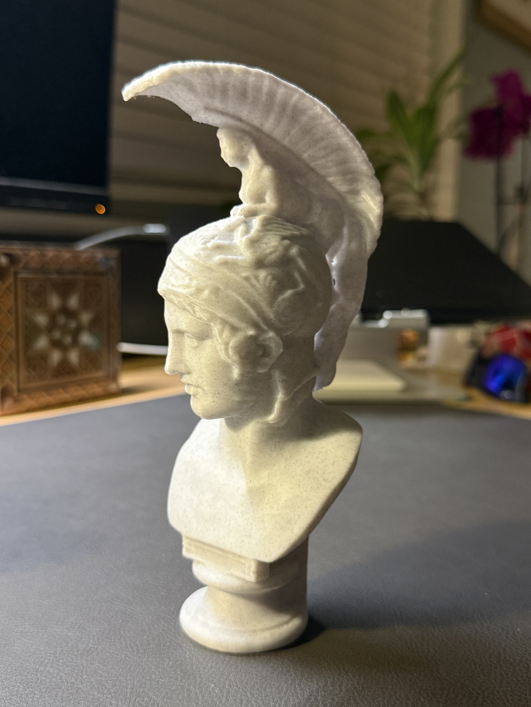
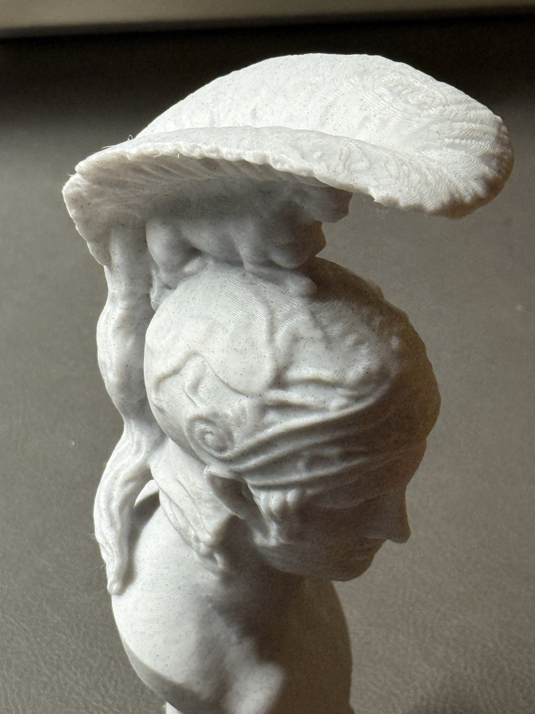
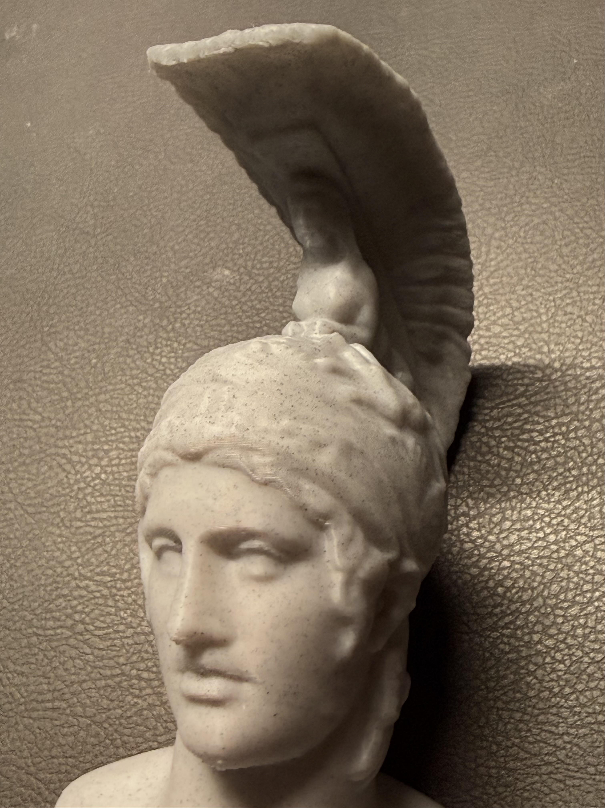


"Moar statues..."


I liked this model a lot too (and original statue), but alas it is not as detailed as the [Marcus Aurelius]() one.

Model: [link](https://makerworld.com/en/models/1730963-ares#profileId-1838586)


<figure class="grid-w33"></figure>
<figure class="grid-w33"></figure>
<figure class="grid-w33"></figure>


