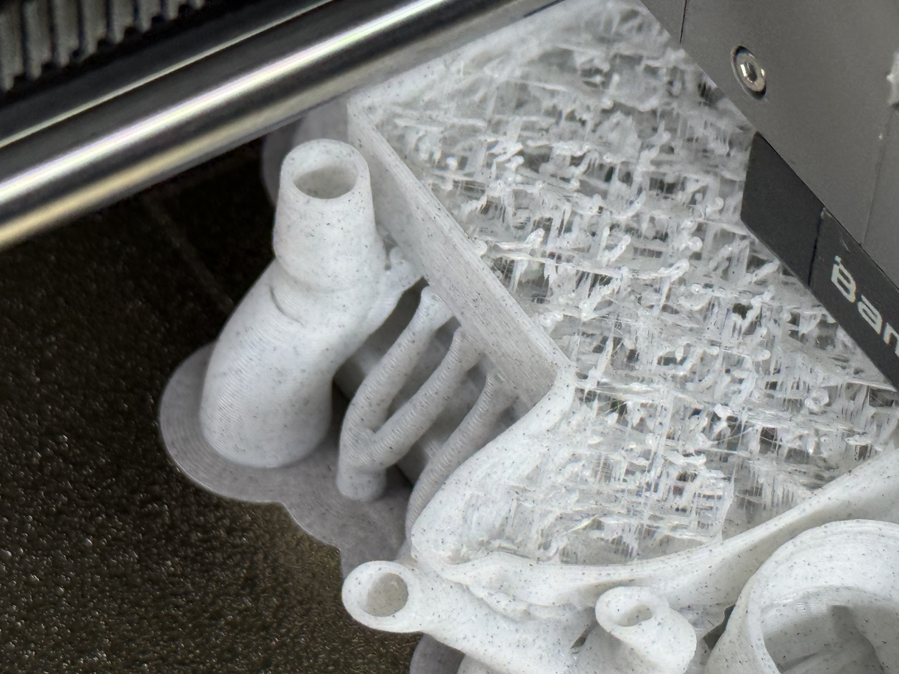
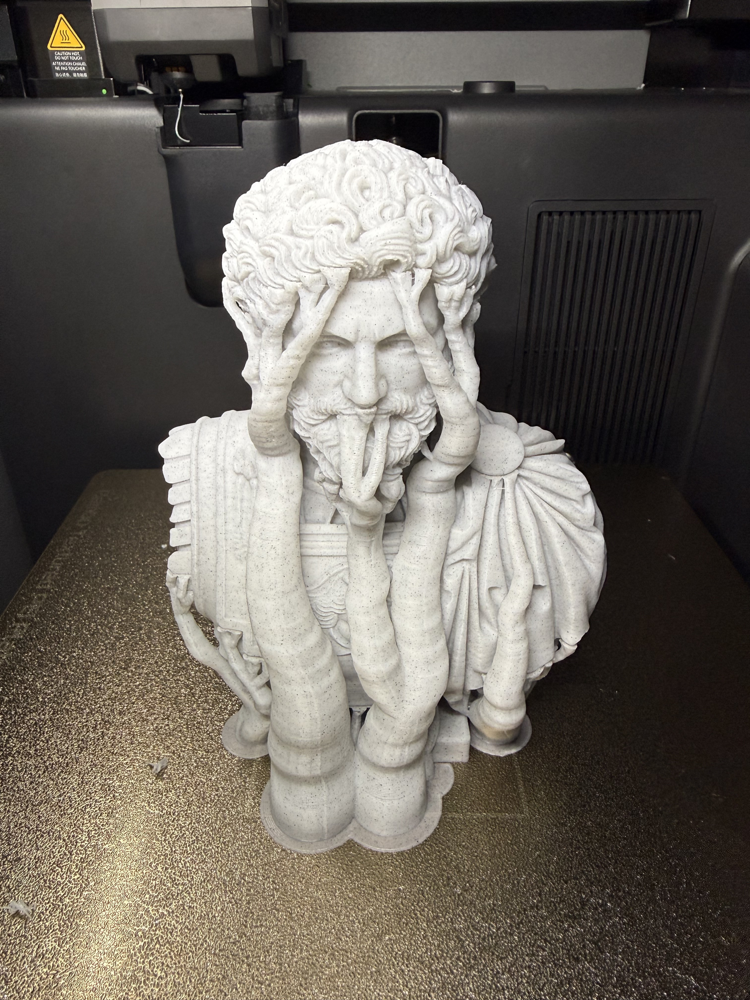
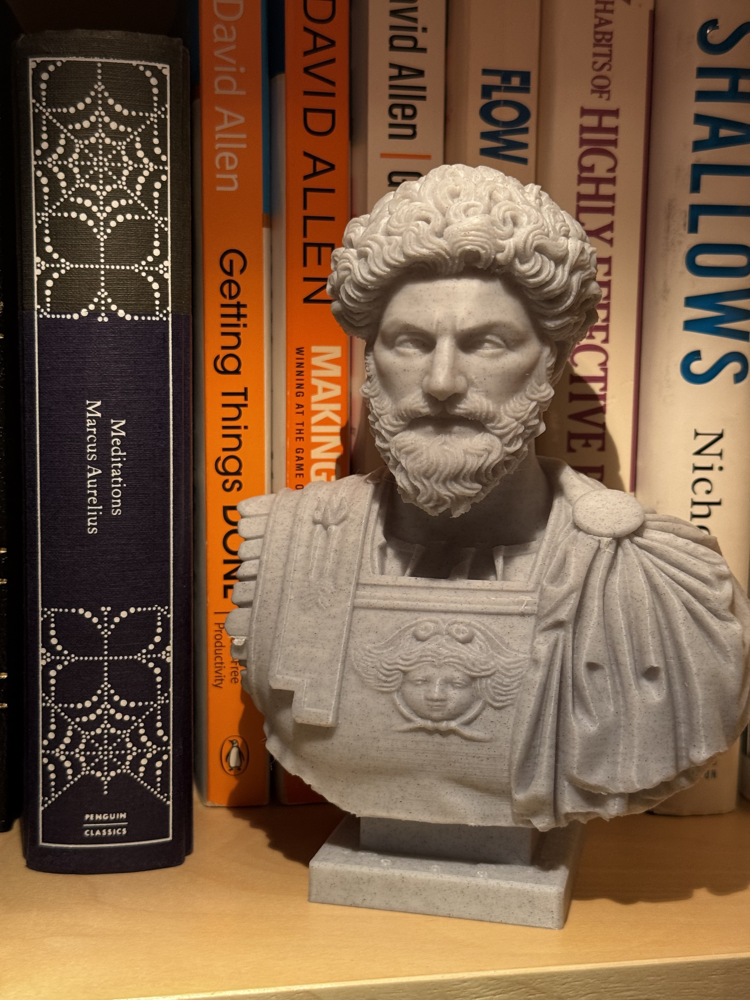
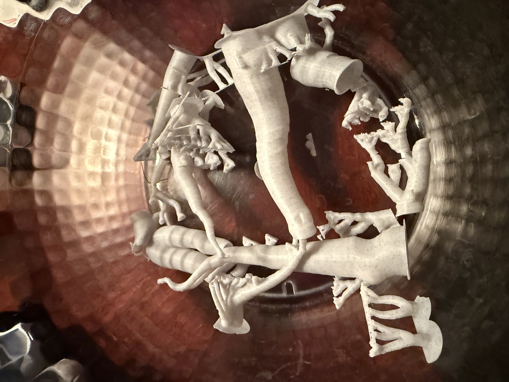


"The impediment to action advances action. What stands in the way becomes the way." -- Marcus Aurelius


Model: [link](https://makerworld.com/en/models/2333058-marcus-aurelius-marc-aurele-bust#profileId-2549110)

Now that I picked up Marble filament (Elegoo PLA Marble Cement Grey), I am trying out some busts and other statue-like items. First up, Marcus Aurelius bust.

Initially I was quite concerned as the crosshatch fill was terrible, completely failed (I suspect 7% infill setting the blueprint had was just too sparse for this type of filament).


<figure class="grid-w100"></figure>


However, in the end it came out really well, way better than I expected. Even the layers (used default 0.2mm IIRC) are not noticeable at all.

Colour me surprised!


<figure class="grid-w50"></figure><figure class="grid-w50"></figure>


P.S. And even the removal of tree supports wasn't all that bad...


<figure class="grid-w100"></figure>

