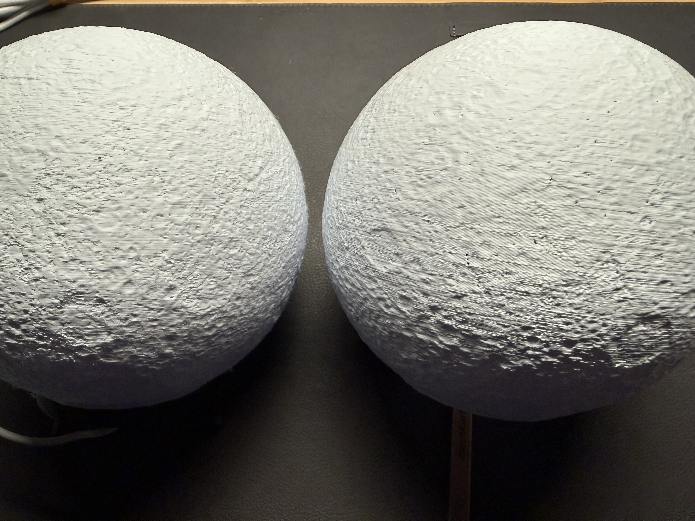
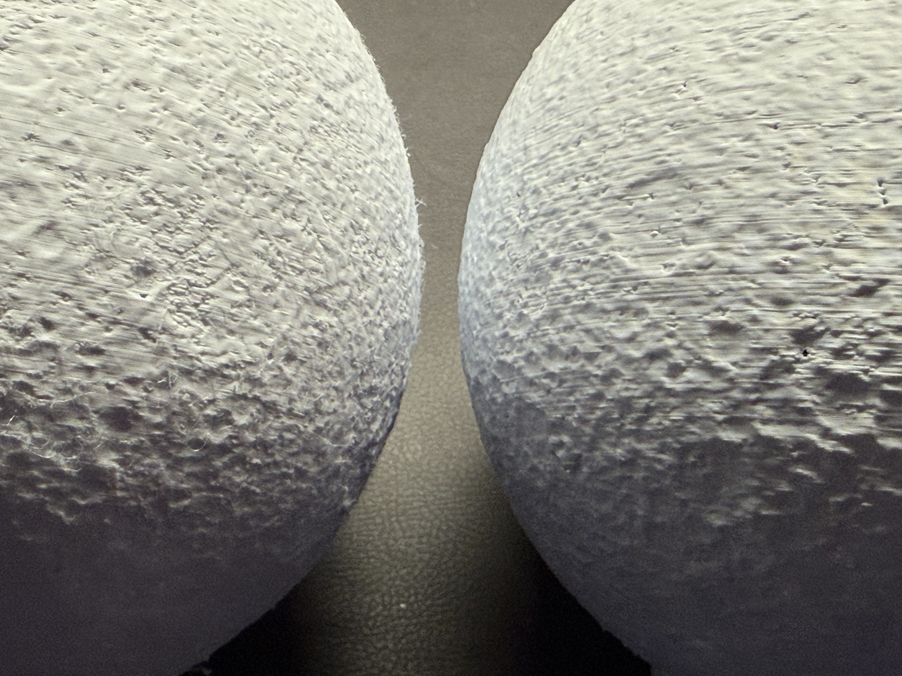
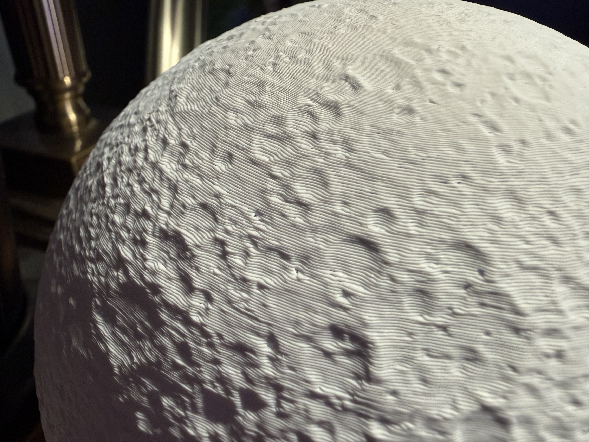
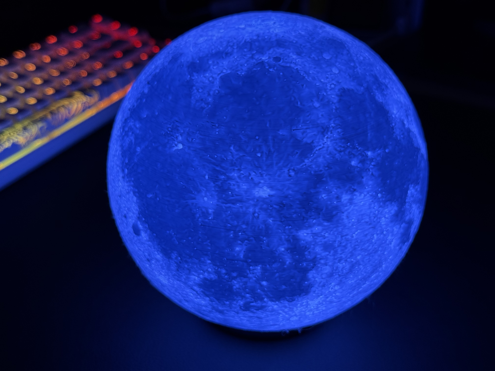

 We gonna need a smaller nozzle... 

Attempt #2 on printing a "moon" lamp lithophane, after asking Gemini for how best to optimize BambuStudio settings... meh. Basically the same; slight improvement on reduced number of pinholes (under-extrusion).

I'm thinking I'm at limits of what I can do with 0.4mm nozzle, so probably time to get a 0.2mm if I want better results. Although... the other thing I don't like is the melted/eroded look to the flatter sections. Well, I guess I'll start with 0.2mm, I was going to get that hotend anyways.


<figure class="grid-w50"></figure><figure class="grid-w50"></figure><figure class="grid-w50"></figure><figure class="grid-w50"></figure>

